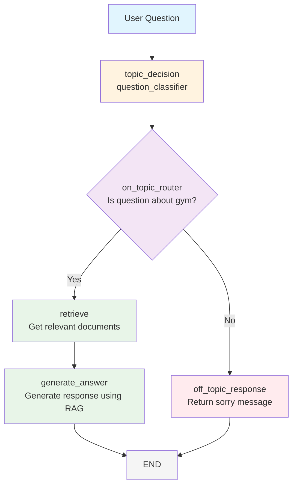

# RAG System Workflow Diagram

This diagram shows the flow of the RAG (Retrieval-Augmented Generation) system with topic classification for Peak Performance Gym.

## Workflow Flow

## Node Descriptions

### 1. topic_decision (question_classifier)
- **Purpose**: Classifies whether the user's question is about gym-related topics
- **Topics Covered**:
  - Gym History & Founder
  - Operating Hours
  - Membership Plans
  - Fitness Classes
  - Personal Trainers
  - Facilities & Equipment
- **Output**: Sets `state["on_topic"]` to "Yes" or "No"

### 2. on_topic_router
- **Purpose**: Routes the flow based on topic classification
- **Logic**: 
  - If "Yes" → go to "retrieve"
  - If "No" → go to "off_topic_response"

### 3. retrieve
- **Purpose**: Retrieves relevant documents using MMR (Maximal Marginal Relevance) search
- **Method**: Uses Chroma vector store with k=3 documents
- **Output**: Sets `state["documents"]` with retrieved documents

### 4. generate_answer
- **Purpose**: Generates the final answer using RAG
- **Process**: 
  - Takes retrieved documents as context
  - Uses GPT-4o to generate response
  - Appends AI message to conversation

### 5. off_topic_response
- **Purpose**: Handles questions not related to gym topics
- **Action**: Appends "I'm sorry! I cannot answer this question!" message

## State Management

The system uses `AgentState` with:
- `messages`: List of conversation messages
- `documents`: Retrieved documents for RAG
- `on_topic`: Classification result ("Yes"/"No")

## Key Features

1. **Topic Classification**: Prevents off-topic questions from being processed
2. **RAG Integration**: Uses vector similarity search for relevant context
3. **Structured Output**: Uses Pydantic models for reliable classification
4. **LangGraph Workflow**: Clean separation of concerns with conditional routing
